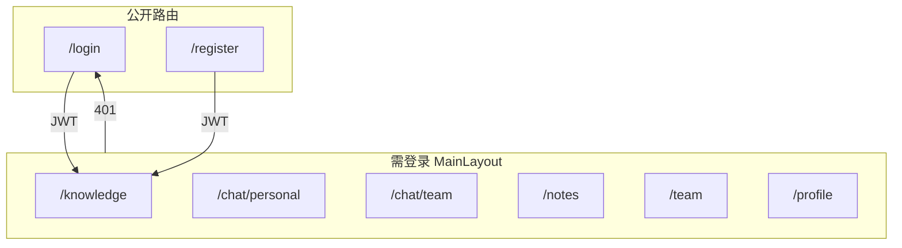

# 学生 AI 知识工作台 — 前端开发计划

## 现状与目标

| 维度 | 现状 | 目标 |
|------|------|------|
| 前端代码 | [frontend/src/App.vue](frontend/src/App.vue) 默认模板，路由为空 | 6 大功能模块完整 UI + 交互 |
| 视觉参考 | [Page-prototype/all.html](Page-prototype/all.html) 莫兰迪色系高保真原型 | 组件化迁移，保留视觉风格 |
| 接口 | [docs/rest-api.md](docs/rest-api.md) 41 个接口 | MSW Mock 先行，API 层统一封装便于切换 |
| 鉴权 | 无 | JWT + 路由守卫 + Axios 拦截器 |

**已确认决策**：Mock 优先开发；个人问答与团队问答**分开展示**，团队问答不传 `categoryIds`。

---

## 技术选型

在现有 **Vue 3.5 + Vite 8 + Vue Router 5 + Pinia 3** 基础上新增：

| 类别 | 选型 | 理由 |
|------|------|------|
| 样式 | **Tailwind CSS v4** + 原型 Morandi 色板 | 与 all.html 一致，迁移成本最低 |
| 图标 | **@fortawesome/fontawesome-free** | 原型已用 Font Awesome |
| HTTP | **axios** | 拦截器统一处理 Token / 错误 |
| Mock | **MSW (Mock Service Worker)** | 开发期拦截 `/api/*`，后端就绪后关闭即可 |
| Markdown | **md-editor-v3**（编辑）+ **marked**（预览/问答渲染） | 需求指定开源 Markdown 编辑器 |
| 文件预览 | **@vue-office/pdf** + **@vue-office/docx** | 需求推荐方案；MD 用 marked 只读渲染 |
| 工具 | **@vueuse/core** | 主题跟随系统、防抖搜索等 |

> 不引入 Element Plus / Naive UI，保持原型轻量 Tailwind 风格。

---

## 目录结构

```
frontend/src/
├── api/                    # axios 实例 + 按模块拆分（auth/user/category/file/note/chat/team）
├── mocks/                  # MSW handlers + mock 数据种子
├── assets/styles/          # tailwind 入口 + morandi 主题变量 + markdown 样式
├── components/
│   ├── layout/             # AppHeader, AppSidebar, MainLayout
│   ├── common/             # Toast, Modal, ConfirmDialog, EmptyState, Pagination
│   ├── knowledge/          # CategoryCard, FileTable, FilePreviewModal, SyncStatusBadge
│   ├── chat/               # ConversationList, ChatMessage, PersonalChatPanel, TeamChatPanel
│   ├── notes/              # NoteList, NoteEditor, TagFilter
│   ├── team/               # TeamCard, MemberList, InviteModal, PendingInvitations
│   └── profile/            # AvatarUpload, ThemeSelector, PasswordForm
├── composables/            # useTheme, useToast, useAuth
├── router/                 # 路由 + 守卫
├── stores/                 # auth, theme, (可选) ui
├── utils/                  # formatDate, fileTypeIcon, syncStatusLabel
└── views/
    ├── auth/LoginView.vue, RegisterView.vue
    ├── knowledge/KnowledgeView.vue
    ├── chat/PersonalChatView.vue, TeamChatView.vue
    ├── notes/NotesView.vue
    ├── team/TeamView.vue
    └── profile/ProfileView.vue
```

---

## 路由设计



| 路由 | 对应模块 | 说明 |
|------|----------|------|
| `/login` `/register` | 3.1 账号 | 原型缺失，需新建，风格对齐 Morandi |
| `/knowledge` | 3.3 知识库 | 迁移原型 knowledge section |
| `/chat/personal` | 3.4 个人问答 | **独立页**：左侧会话列表 + 分类多选 + 聊天气泡 |
| `/chat/team` | 3.4 团队问答 | **独立页**：选团队 → 直接提问，**不传 categoryIds** |
| `/notes` | 3.5 笔记 | 迁移原型，**tags 改为多标签数组** |
| `/team` | 3.6 团队 | 扩展原型：我创建的 / 我加入的 / 待接受邀请 |
| `/profile` | 3.1 个人中心 | 迁移原型 profile section |

侧边栏导航与原型一致 5+1 项，但 AI 问答拆为两个入口（或 AI 问答父菜单下两个子项）。

---

## 原型 → 正式前端的关键差异处理

| 点 | all.html 原型 | 正式实现（按需求/API） |
|----|---------------|------------------------|
| 登录 | 无，演示角色切换 | 登录/注册页 + JWT；**移除**顶部角色切换按钮 |
| 品牌名 | OCU.copilot | 改为「学生 AI 知识工作台」（或保留副标题） |
| 同步状态 | `is_sync` 布尔 | `syncStatus` **0/1/2** 三态 Badge |
| 笔记标签 | 单字段 `tag` | `tags: string[]` 多标签 + 模糊筛选 |
| 问答 | 个人+共享混合选题 | **个人页**选手动 categoryIds；**团队页**选 teamId，后端自动取创建者全部分类 |
| 会话 | 扁平消息列表 | 左侧 **conversation 列表**（`GET /api/chat/conversations`）+ 多轮续聊 `conversationId` |
| 团队 | 单团队硬编码 | 多团队：`managed` / `joined` / `pending invitations` 三个区块 |
| 文件预览 | 假文本 | 调 `preview-url` API → vue-office / marked 真实渲染 |
| 删除 | 物理删除 | 调 DELETE API（逻辑删除由后端处理） |

---

## 基础设施层

### 1. Axios 封装 — `src/api/request.js`

- `baseURL: '/api'`
- 请求拦截：自动附加 `Authorization: Bearer <token>`
- 响应拦截：统一解析 `Result<T>`（`code !== 200` 抛错 + Toast）
- `401` 清 Token 跳转 `/login`

### 2. MSW Mock — `src/mocks/`

- 开发环境在 [frontend/src/main.js](frontend/src/main.js) 条件启动 MSW
- 按 [docs/rest-api.md](docs/rest-api.md) 实现全部 41 个 handler
- Mock 数据用内存 Store（可辅以 `localStorage` 持久化），支持 CRUD 联动（如删分类连带删文件）
- 环境变量 `VITE_USE_MOCK=true/false` 控制开关，后端就绪后设为 `false`

### 3. Pinia Stores

- **authStore**：`token`、`user`（含 `roles`）、`login/logout/fetchProfile`
- **themeStore**：`light/dark/system`，初始化读 user.theme，切换调 `PUT /api/user/theme` 并同步 `document.documentElement.classList`

### 4. Vite 代理修正

当前 [frontend/vite.config.js](frontend/vite.config.js) 的 `rewrite` 会去掉 `/api` 前缀，与 API 文档冲突。联调真实后端时需**移除 rewrite**，保留 `/api` 原样转发。

### 5. Tailwind 主题迁移

从 all.html 提取 Morandi 色板到 `tailwind.config.js`：

```js
colors: {
  morandi: {
    clay: '#C08261', clayHover: '#A86F51', peach: '#D99B82',
    sage: '#8EA891', sand: '#FAF6F0', darkBg: '#1C1614', ...
  }
}
```

`darkMode: 'class'`，与 themeStore 联动。

---

## 各模块实现要点

### 模块 A：认证（Login / Register）

- 表单校验：用户名非空、密码 ≥ 6、确认密码一致
- 成功后存 Token + user → 跳转 `/knowledge`
- 路由守卫：`meta.requiresAuth`

### 模块 B：知识库（/knowledge）

迁移原型 [all.html L192-L352](Page-prototype/all.html) 布局：

- **分类卡片 Grid**：`GET /api/categories`；创建/重命名/删除 Modal
- **同步按钮**：`POST /api/categories/{id}/sync`；展示返回的 successCount/failCount/failedFiles
- **分类级同步摘要**：根据 `fileCount` / `syncedCount` 或本地文件列表计算「全部/部分/未同步」
- **文件表格**：分页 `GET /api/categories/{id}/files`；上传 multipart；重命名/删除
- **预览 Modal**：`GET /api/files/{id}/preview-url` → 按 fileType 渲染 PDF/Word/MD

### 模块 C：个人问答（/chat/personal）

布局：**三栏**

```
[会话列表] | [分类多选 + 聊天区] | (可选折叠)
```

- 左侧：`GET /api/chat/conversations?type=personal`；新建会话；删除会话
- 中间上方：个人分类 checkbox 多选（至少 1 个，`categoryIds`）
- 聊天气泡：Markdown 渲染 AI 回答；Typing 加载态
- 发送：`POST /api/chat/personal`；首轮不传 `conversationId`，续聊携带
- 底部：清空历史 `DELETE /api/chat/history`

### 模块 D：团队问答（/chat/team）

布局：**三栏**

```
[会话列表] | [团队选择 + 聊天区]
```

- 团队下拉/列表：`GET /api/teams/joined`（过滤 `isShare=1` 的团队）
- **不展示分类选择器**；选中团队后直接提问
- 发送：`POST /api/chat/team`（仅 `question` + `teamId` + 可选 `conversationId`）
- 会话列表：`GET /api/chat/conversations?type=team`
- 权限提示：团队未开启共享时禁用输入并展示说明

### 模块 E：笔记（/notes）

迁移原型 [all.html L541-L683](Page-prototype/all.html)：

- 左侧：笔记列表 + 标题搜索 + **多标签筛选**（tags 数组去重）
- 右侧：md-editor-v3 编辑 + 实时预览分栏
- CRUD 对接 `/api/notes`；标签输入支持逗号/回车添加多个
- 自动保存：编辑防抖后 `PUT /api/notes/{id}`

### 模块 F：团队（/team）

在原型基础上扩展为多团队完整流程：

| 区块 | API | UI |
|------|-----|-----|
| 待接受邀请 | `GET /api/teams/invitations/pending` | 卡片 + 接受/拒绝按钮 |
| 我创建的团队 | `GET /api/teams/managed` | 管理入口：成员/邀请/共享开关/解散 |
| 我加入的团队 | `GET /api/teams/joined` | 只读信息 + 退出按钮 |
| 创建团队 | `POST /api/teams` | Modal（需无团队时或随时可创建多个） |
| 成员管理 | members/invite/remove | 邀请 Modal（用户名精准匹配） |
| 共享资源浏览 | `GET /api/teams/{id}/categories` + files | 成员只读预览（复用 FilePreviewModal） |
| 共享开关 | `PUT /api/teams/{id}/share` | Toggle（仅 creator_id 本人） |

侧边栏「团队共享状态」挂件改为展示当前选中/第一个已加入团队摘要。

### 模块 G：个人中心（/profile）

- 头像上传（≤2MB，jpg/png）：`POST /api/user/avatar`
- 主题三选一：同步 themeStore
- 修改密码：`PUT /api/user/password`
- 退出登录：清 Token → `/login`

---

## 公共组件

| 组件 | 用途 |
|------|------|
| `Toast.vue` | 迁移原型 Toast（success/error/info） |
| `BaseModal.vue` | 创建/重命名/邀请等弹窗统一壳 |
| `ConfirmDialog.vue` | 删除确认 |
| `Pagination.vue` | 列表分页（page/size/total） |
| `SyncStatusBadge.vue` | 0 未同步 / 1 成功 / 2 失败 |
| `FilePreviewModal.vue` | PDF/Word/MD 预览 |
| `EmptyState.vue` | 各模块空态 |

---

## 开发分期（建议顺序）

```mermaid
gantt
  title 前端开发分期
  dateFormat X
  axisFormat %s

  section Phase1
  基础设施_Tailwind_Router_Auth_MSWR :0, 2
  section Phase2
  登录注册_Layout :2, 1
  section Phase3
  知识库模块 :3, 2
  section Phase4
  笔记模块 :5, 1
  section Phase5
  个人问答_团队问答 :6, 2
  section Phase6
  团队模块 :8, 2
  section Phase7
  个人中心_联调收尾 :10, 1
```



1. **Phase 1** — 依赖安装、Tailwind 主题、Axios、MSW 骨架、Layout 组件
2. **Phase 2** — 登录/注册 + 路由守卫 + authStore
3. **Phase 3** — 知识库（分类 CRUD、文件上传/预览、Dify 同步）
4. **Phase 4** — 笔记（多标签、Markdown 双栏）
5. **Phase 5** — 个人问答 + 团队问答（会话列表、多轮对话）
6. **Phase 6** — 团队管理（邀请/接受/共享浏览）
7. **Phase 7** — 个人中心、主题持久化、Mock→真实 API 切换验证

---

## 后端联调切换清单

当后端 API 可用时：

1. 设置 `VITE_USE_MOCK=false`
2. 修正 [frontend/vite.config.js](frontend/vite.config.js) 代理（去掉 `/api` rewrite）
3. 确认后端 CORS 与 JWT 格式一致
4. 逐模块冒烟测试 41 个接口

---

## 风险与注意事项

- **文件预览**：vue-office 对大文件可能较慢，预览 Modal 加 loading 态
- **Dify 同步**：API 为同步阻塞，前端按钮需 loading + 禁用防重复提交
- **团队权限**：UI 层按 `creatorId === currentUser.id` 控制管理按钮，不仅看 `TEAM_CREATOR` 角色
- **会话续聊**：切换会话时清空当前消息区，加载 `GET /api/chat/conversations/{id}` 历史
- **Mock 数据一致性**：MSW handler 需模拟分页、409 冲突、403 越权等错误场景，便于 UI 测试
