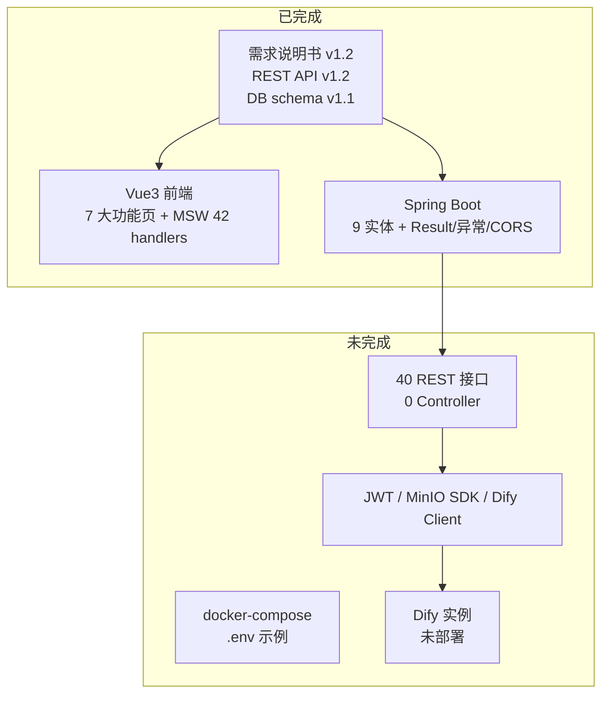
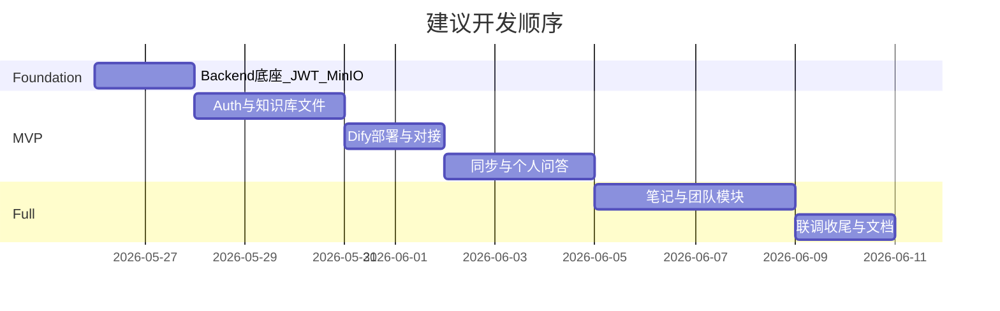

# 学生 AI 知识工作台 — 后续开发评估与计划

## 一、当前完成度总览

| 层级 | 状态 | 说明 |
|------|------|------|
| 文档 | 完整 | [docs/学生AI知识工作台软件需求说明书.md](docs/学生AI知识工作台软件需求说明书.md)、[docs/rest-api.md](docs/rest-api.md)、[database/schema.sql](database/schema.sql) 已对齐 |
| 数据库 | 就绪 | 9 表脚本 + JPA 实体已一一对应 |
| 前端 | **功能页基本完成** | 路由、API 封装、各模块 UI 已实现；默认靠 `VITE_USE_MOCK` + [frontend/src/mocks/handlers.js](frontend/src/mocks/handlers.js) |
| 后端 | **数据层脚手架** | 无 `controller` / `repository` / `service` / `dto`；[SecurityConfig](backend/src/main/java/com/example/diagnoseillusion/config/SecurityConfig.java) 仍为 `permitAll` |
| 外部依赖 | 部分就绪 | 你确认 MySQL、MinIO 可用；**Dify 未部署** — 阻塞「同步知识库」与「智能问答」真联调 |

**结论**：项目处于「前端 + 契约 + 数据模型」阶段，**瓶颈在后端 API 与 Dify 环境**；前端无需大改即可对接，但需关闭 MSW 并逐步切到 `:8080`。

---

## 二、前端缺口（非阻塞 MVP，可第二批处理）

以下不影响「登录 → 上传 → 预览」MVP，但应在全量上线前处理：

| 项 | 现状 | 文档要求 |
|----|------|----------|
| 主题 API | [frontend/src/stores/theme.js](frontend/src/stores/theme.js) 仍调用已删除的 `PUT /api/user/theme` | v1.2 主题仅存 `localStorage`（[rest-api.md §3.0](docs/rest-api.md)） |
| 首页检索模式 | `HomeView` 传 `?mode=fast\|deep`，聊天页未读取 | 需求未定义后端差异；可删 UI 或仅作展示 |
| 团队创建者角色 | `auth.isTeamCreator` 未用于隐藏/展示入口 | 需求 §3.2 粗粒度展示 |
| 未用 API | `fileApi.listAll`、`chatApi.deleteHistory`、`teamApi.detail` | 可选接口，可补 UI 或删导出 |
| 团队聊天 | 无「清空全部历史」 | 个人聊天已有 `clearHistory` |

---

## 三、推荐实施路线（按你选的 E2E MVP）

### 阶段 0：后端公共底座（1–2 天）

在 [backend/](backend/) 补齐所有模块共用能力：

- **依赖**：`jjwt`（或 Spring Security JWT）、`validation`、`minio` Java SDK
- **包结构**：`repository` → `dto`（含分页 `PageResult`）→ `service` → `controller`
- **安全**：JWT Filter + `UserDetailsService`；放行 `/api/auth/**`，其余需认证
- **配置**：[application.yml](backend/src/main/resources/application.yml) 增加 MinIO、JWT、`dify.*`、`upload.*`（对齐 [rest-api.md §1.2](docs/rest-api.md)）
- **逻辑删除**：列表/详情统一 `is_deleted = 0`；DELETE 走软删

可参考已有 [Result.java](backend/src/main/java/com/example/diagnoseillusion/common/Result.java) 与 MSW 行为保持响应形状一致。

### 阶段 1：MVP 链路 A — 无 Dify（可立即联调前端）

目标：**真实后端 + 前端关闭 Mock**，完成账号与知识库文件闭环。

| 顺序 | 接口（共 14 个） | 模块 |
|------|------------------|------|
| 1 | `POST /auth/register`、`POST /auth/login` | 认证 + BCrypt + 默认 `USER` 角色 |
| 2 | `GET /user/profile`、`PUT /user/password`、`POST /user/avatar` | 个人中心 + MinIO `avatars/` |
| 3 | 分类 CRUD ×4 | `file_category` |
| 4 | 文件上传/列表/重命名/删除/预览 URL ×5 | MinIO `files/{userId}/{categoryId}/` + 预签名 URL |

**验收**：新用户注册 → 建分类 → 上传 pdf/md → 列表展示 `syncStatus=0` → 预览 URL 可在 [FilePreviewModal.vue](frontend/src/components/knowledge/FilePreviewModal.vue) 打开。

**同步前端小改**：移除 `userApi.updateTheme` 调用，主题仅 `localStorage`（避免 404）。

### 阶段 2：Dify 环境 + MVP 链路 B（AI 核心）

**前置（需你本地完成）**：

1. 部署 Dify（Docker），创建 **Dataset 型知识库** 与 **Chat/工作流应用**
2. 记录 `base-url`、`dataset-api-key`、`app-api-key` 写入环境变量（勿提交仓库）
3. 在 Dify 控制台配置 RAG、Prompt；后端只转发

**后端实现**：

| 接口 | 职责 |
|------|------|
| `POST /categories/{id}/sync` | 阻塞同步：对该分类 `sync_status in (0,2)` 的文件逐个上传 Document，更新 `dify_dataset_id` / `dify_document_id` / 三态 |
| `POST /chat/personal` | 校验 `category_ids` 归属与已同步，组装 `dify_dataset_id` 转发，写 `chat_history` |
| `GET /chat/conversations`、`GET .../{conversationId}` | 会话聚合与多轮详情 |

**Dify 未就绪时的过渡方案**（二选一，建议 A）：

- **A**：实现 `DifyClient` 接口 + `StubDifyClient` 返回固定答案，便于答辩演示；环境就绪后切换 `RealDifyClient`
- **B**：MVP 阶段仅 Mock 同步/问答接口，其余走真实库 — 演示时需说明 AI 为模拟

**验收**：上传文件 → 手动同步 → `syncStatus=1` → 个人聊天选分类提问 → 历史列表可见多轮 `conversation_id`。

### 阶段 3：补齐自研 CRUD（无新外部依赖）

按业务依赖顺序实现剩余 **26 个接口**：

1. **笔记**（5）：`GET/POST/PUT/DELETE /notes` + 标签模糊搜
2. **问答历史删**（3）：单条、会话、清空
3. **团队**（15）：创建/邀请/共享开关/只读共享列表等；严格校验 `creator_id` 与 `team_member.status`
4. **团队问答**（1）：`POST /chat/team`（依赖阶段 2 的 Dify）

**验收**：与 MSW 行为对照 [handlers.js](frontend/src/mocks/handlers.js) 逐接口回归；`VITE_USE_MOCK=false` 全站可走通。

### 阶段 4：收尾与答辩准备

- **docker-compose**：MySQL + MinIO + 后端（你已有部分环境，补全编排与 README）
- **前端**：`isTeamCreator` 控制「创建团队」；团队聊天补 `clearHistory`（可选）
- **安全**：共享预览 `preview-url` 校验成员 + `is_share=1`
- **测试**：至少 Auth + File + Team 权限的集成测试（可选 Postman/Apifox 集合）

---

## 四、建议时间线与优先级

**当前最该动手**：阶段 0 + 阶段 1（不依赖 Dify，与你现有 MySQL/MinIO 匹配）。

**并行任务**：你可同时部署 Dify，避免阶段 2 空等。

---

## 五、关键文件索引

| 用途 | 路径 |
|------|------|
| 需求依据 | [docs/学生AI知识工作台软件需求说明书.md](docs/学生AI知识工作台软件需求说明书.md) |
| 接口契约 | [docs/rest-api.md](docs/rest-api.md) |
| 前端 API | [frontend/src/api/index.js](frontend/src/api/index.js) |
| Mock 参考实现 | [frontend/src/mocks/handlers.js](frontend/src/mocks/handlers.js) |
| 实体层 | [backend/src/main/java/com/example/diagnoseillusion/entity/](backend/src/main/java/com/example/diagnoseillusion/entity/) |

---

## 六、仍需你后续确认的一点（非阻塞计划）

Dify 部署完成后，请确认采用的是 **Dataset API + Chat API** 还是 **单一工作流 API**（需求允许实现阶段定路径）。若你已有 Dify 应用类型截图或 API 文档，实现 `DifyClient` 时可一次性对齐，避免返工。
