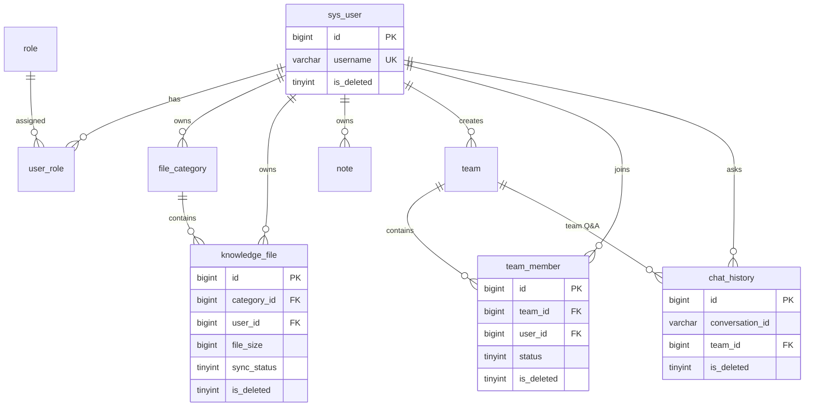

# 学生 AI 知识工作台 — 数据库设计说明书

> **版本**：v1.1（Review 后修订）  
> **依据**：《学生AI知识工作台软件需求说明书》v1.2  
> **状态**：已按 Review 意见更新  
> **数据库**：MySQL 8.0+（推荐 8.0，支持 JSON 类型）

---

## 1 设计概述

### 1.1 设计目标

- 覆盖需求说明书全部 **9 张核心表**
- 字段语义与需求 v1.2 一致
- 表名采用 `sys_user`、`knowledge_file`，避免 MySQL 保留词问题
- 全表统一 **逻辑删除**（`is_deleted`）
- 满足期末项目：结构简单、CRUD 友好、便于 SpringBoot 映射

### 1.2 命名与规范

| 规范项 | 约定 |
|--------|------|
| 字符集 | `utf8mb4` / `utf8mb4_unicode_ci` |
| 存储引擎 | `InnoDB` |
| 主键 | `BIGINT UNSIGNED AUTO_INCREMENT` |
| 时间字段 | `create_time`、`update_time`（`DATETIME`） |
| 逻辑删除 | `is_deleted TINYINT`，`0` 未删除 / `1` 已删除 |
| 物理删除 | **默认不使用**；删除操作统一走逻辑删除 |
| 枚举字段 | `TINYINT` + 注释 |

### 1.3 逻辑删除通用规则

1. **所有业务查询**默认带条件 `is_deleted = 0`
2. **删除操作**统一执行 `UPDATE ... SET is_deleted = 1, update_time = NOW()`
3. **外键不做 ON DELETE CASCADE**：逻辑删除不触发级联；外键仅保证引用完整性
4. **唯一约束与逻辑删除冲突处理**：逻辑删除时，对占用唯一约束的字段加后缀释放名称，例如：
   - 用户：`username` → `{username}__del_{id}`
   - 分类：`category_name` → `{name}__del_{id}`
   - 团队成员：一般**不新建行**，通过更新 `status` / `is_deleted` 复用原记录（见 §3.8）

> **【说明】** `role` 表虽含 `is_deleted` 字段，系统预设角色固定为 `0`，不做删除。

---

## 2 ER 关系概览



---

## 3 表结构明细

### 3.1 用户表 `sys_user`

| 字段 | 类型 | 约束 | 说明 |
|------|------|------|------|
| id | BIGINT UNSIGNED | PK, AI | 用户 ID |
| username | VARCHAR(50) | NOT NULL, UNIQUE | 登录用户名 |
| password | VARCHAR(100) | NOT NULL | BCrypt 密文 |
| avatar | VARCHAR(512) | NULL | MinIO object key |
| theme | VARCHAR(20) | NOT NULL, DEFAULT 'system' | light / dark / system |
| is_deleted | TINYINT | NOT NULL, DEFAULT 0 | 逻辑删除 |
| create_time | DATETIME | NOT NULL | 创建时间 |
| update_time | DATETIME | NOT NULL | 更新时间 |

**业务规则**：

- 若用户仍是某未解散团队（`team.is_deleted=0`）的 `creator_id`，**不允许**逻辑删除账号
- 逻辑删除用户时，将 `username` 加后缀 `__del_{id}`，避免占用唯一约束导致无法重新注册

---

### 3.2 角色表 `role`

| 字段 | 类型 | 约束 | 说明 |
|------|------|------|------|
| id | BIGINT UNSIGNED | PK, AI | 角色 ID |
| role_name | VARCHAR(50) | NOT NULL, UNIQUE | 英文 code：`USER` / `TEAM_CREATOR` |
| role_desc | VARCHAR(200) | NULL | 中文描述，供展示映射 |
| is_deleted | TINYINT | NOT NULL, DEFAULT 0 | 固定为 0 |
| create_time | DATETIME | NOT NULL | 创建时间 |
| update_time | DATETIME | NOT NULL | 更新时间 |

**初始化数据**：

| id | role_name | role_desc |
|----|-----------|-----------|
| 1 | USER | 普通用户 |
| 2 | TEAM_CREATOR | 团队创建者 |

前端 / 后端常量映射英文 code → 中文展示名。

---

### 3.3 用户角色关联表 `user_role`

| 字段 | 类型 | 约束 | 说明 |
|------|------|------|------|
| id | BIGINT UNSIGNED | PK, AI | 主键 |
| user_id | BIGINT UNSIGNED | NOT NULL, FK → sys_user.id | 用户 ID |
| role_id | BIGINT UNSIGNED | NOT NULL, FK → role.id | 角色 ID |
| is_deleted | TINYINT | NOT NULL, DEFAULT 0 | 逻辑删除 |
| create_time | DATETIME | NOT NULL | 分配时间 |
| update_time | DATETIME | NOT NULL | 更新时间 |

**索引**：`uk_user_role (user_id, role_id)`、`idx_user_role_user_id (user_id)`

---

### 3.4 知识库分类表 `file_category`

| 字段 | 类型 | 约束 | 说明 |
|------|------|------|------|
| id | BIGINT UNSIGNED | PK, AI | 分类 ID |
| category_name | VARCHAR(100) | NOT NULL | 分类名称 |
| user_id | BIGINT UNSIGNED | NOT NULL, FK → sys_user.id | 所属用户 |
| dify_dataset_id | VARCHAR(128) | NULL | Dify Dataset ID |
| is_deleted | TINYINT | NOT NULL, DEFAULT 0 | 逻辑删除 |
| create_time | DATETIME | NOT NULL | 创建时间 |
| update_time | DATETIME | NOT NULL | 更新时间 |

**索引**：

- `idx_file_category_user_id (user_id)`
- `uk_file_category_user_name (user_id, category_name)` — **同一用户下分类名不可重复**

逻辑删除分类时：`category_name` 加后缀 `__del_{id}`；下属 `knowledge_file` 同步逻辑删除（并清理 MinIO / Dify，由业务层处理）。

---

### 3.5 文件表 `knowledge_file`

| 字段 | 类型 | 约束 | 说明 |
|------|------|------|------|
| id | BIGINT UNSIGNED | PK, AI | 文件 ID |
| file_name | VARCHAR(255) | NOT NULL | 展示文件名 |
| file_type | VARCHAR(10) | NOT NULL | md / pdf / doc / docx |
| file_path | VARCHAR(512) | NOT NULL | MinIO object key |
| file_size | BIGINT UNSIGNED | NULL | 文件大小（字节） |
| category_id | BIGINT UNSIGNED | NOT NULL, FK → file_category.id | 所属分类 |
| user_id | BIGINT UNSIGNED | NOT NULL, FK → sys_user.id | 所属用户（冗余） |
| sync_status | TINYINT | NOT NULL, DEFAULT 0 | 0 未同步 / 1 成功 / 2 失败 |
| dify_document_id | VARCHAR(128) | NULL | Dify Document ID |
| is_deleted | TINYINT | NOT NULL, DEFAULT 0 | 逻辑删除 |
| create_time | DATETIME | NOT NULL | 上传时间 |
| update_time | DATETIME | NOT NULL | 更新时间 |

**索引**：

- `idx_knowledge_file_category_id (category_id)`
- `idx_knowledge_file_user_id (user_id)`
- `idx_knowledge_file_sync_status (category_id, sync_status)`

#### 关于 `user_id` 冗余字段（Review 第 10 点）

**建议保留**，理由：

| 优点 | 说明 |
|------|------|
| 查询更简单 | 「我的全部文件」只需 `WHERE user_id = ? AND is_deleted = 0`，不必 JOIN `file_category` |
| 权限校验更快 | 文件预览/下载时可直接校验 `knowledge_file.user_id` |
| 团队共享场景清晰 | 成员访问的是创建者的文件，与个人 `user_id` 字段含义不冲突 |

**一致性要求**：上传文件时，`user_id` 必须与 `file_category.user_id` 一致，由 Service 层写入时校验。

---

### 3.6 笔记表 `note`

| 字段 | 类型 | 约束 | 说明 |
|------|------|------|------|
| id | BIGINT UNSIGNED | PK, AI | 笔记 ID |
| title | VARCHAR(200) | NOT NULL | 标题 |
| content | LONGTEXT | NOT NULL | Markdown 正文 |
| tags | JSON | NULL | 多标签，如 `["Java","期末"]` |
| user_id | BIGINT UNSIGNED | NOT NULL, FK → sys_user.id | 所属用户 |
| is_deleted | TINYINT | NOT NULL, DEFAULT 0 | 逻辑删除 |
| create_time | DATETIME | NOT NULL | 创建时间 |
| update_time | DATETIME | NOT NULL | 更新时间 |

**索引**：`idx_note_user_id (user_id)`

---

### 3.7 团队表 `team`

| 字段 | 类型 | 约束 | 说明 |
|------|------|------|------|
| id | BIGINT UNSIGNED | PK, AI | 团队 ID |
| team_name | VARCHAR(100) | NOT NULL | 团队名称 |
| creator_id | BIGINT UNSIGNED | NOT NULL, FK → sys_user.id | 创建者 |
| is_share | TINYINT | NOT NULL, DEFAULT 0 | 0 关闭 / 1 开启共享 |
| is_deleted | TINYINT | NOT NULL, DEFAULT 0 | 逻辑删除（解散团队） |
| create_time | DATETIME | NOT NULL | 创建时间 |
| update_time | DATETIME | NOT NULL | 更新时间 |

**索引**：`idx_team_creator_id (creator_id)`

解散团队：`team.is_deleted = 1`；`team_member` 同步逻辑删除；**`chat_history` 保留**，`team_id` 不变以便历史追溯。

---

### 3.8 团队成员表 `team_member`

| 字段 | 类型 | 约束 | 说明 |
|------|------|------|------|
| id | BIGINT UNSIGNED | PK, AI | 主键 |
| team_id | BIGINT UNSIGNED | NOT NULL, FK → team.id | 团队 ID |
| user_id | BIGINT UNSIGNED | NOT NULL, FK → sys_user.id | 用户 ID |
| member_role | TINYINT | NOT NULL, DEFAULT 0 | 0 普通成员 / 1 创建者 |
| status | TINYINT | NOT NULL, DEFAULT 0 | 0 待接受 / 1 已加入 / 2 已拒绝 |
| is_deleted | TINYINT | NOT NULL, DEFAULT 0 | 逻辑删除 |
| create_time | DATETIME | NOT NULL | 创建/邀请时间 |
| update_time | DATETIME | NOT NULL | 更新时间 |

**索引**：

- `uk_team_member (team_id, user_id)`
- `idx_team_member_user_status (user_id, status)`
- `idx_team_member_team_status (team_id, status)`

**状态流转**：

| 场景 | 操作 |
|------|------|
| 创建团队 | 插入创建者记录：`member_role=1, status=1, is_deleted=0` |
| 邀请成员 | 插入新记录：`status=0`；或复用已拒绝/已退出记录（见下） |
| 接受邀请 | `UPDATE status=1, is_deleted=0` |
| 拒绝邀请 | `UPDATE status=2`（**保留记录，可再次邀请**） |
| 再次邀请（曾被拒绝） | `UPDATE status=0, is_deleted=0, update_time=NOW()`（**同一条记录，改 status 即可**） |
| 移除成员 / 主动退出 | `UPDATE is_deleted=1`；再次邀请时 `UPDATE is_deleted=0, status=0` |
| 解散团队 | 该团队所有 `team_member.is_deleted=1` |

> **【Review 确认】** `status=2` 后再次邀请，无需新行，将 `status` 改回 `0` 即可，满足 `uk_team_member (team_id, user_id)` 约束。

---

### 3.9 问答历史表 `chat_history`

| 字段 | 类型 | 约束 | 说明 |
|------|------|------|------|
| id | BIGINT UNSIGNED | PK, AI | 记录 ID |
| conversation_id | VARCHAR(64) | NOT NULL | Dify 会话 ID |
| question | TEXT | NOT NULL | 用户问题 |
| answer | LONGTEXT | NOT NULL | AI 回答 |
| category_ids | JSON | NOT NULL | 关联分类 ID 列表 |
| category_names | JSON | NULL | 分类名称快照 |
| team_id | BIGINT UNSIGNED | NULL, FK → team.id | 团队问答时有值 |
| user_id | BIGINT UNSIGNED | NOT NULL, FK → sys_user.id | 提问用户 |
| is_deleted | TINYINT | NOT NULL, DEFAULT 0 | 逻辑删除 |
| create_time | DATETIME | NOT NULL | 提问时间 |
| update_time | DATETIME | NOT NULL | 更新时间 |

**索引**：

- `idx_chat_history_user_id (user_id, create_time)`
- `idx_chat_history_conversation (conversation_id, create_time)`
- `idx_chat_history_team_id (team_id)`

**存储规则**：

- 每轮一问一答一行；同 `conversation_id` 聚合为多轮会话
- 解散团队后 **保留历史**，`team_id` 仍指向原团队（团队行 `is_deleted=1` 但 ID 仍在）
- 用户「删除单条 / 按会话删除 / 清空」均走 `is_deleted=1`

---

## 4 外键策略

采用逻辑删除后，外键**不配置 ON DELETE CASCADE**，仅保证引用关系合法：

| 子表 | 外键 | 说明 |
|------|------|------|
| user_role | user_id → sys_user.id | |
| user_role | role_id → role.id | |
| file_category | user_id → sys_user.id | |
| knowledge_file | category_id → file_category.id | |
| knowledge_file | user_id → sys_user.id | |
| note | user_id → sys_user.id | |
| team | creator_id → sys_user.id | |
| team_member | team_id → team.id | |
| team_member | user_id → sys_user.id | |
| chat_history | user_id → sys_user.id | |
| chat_history | team_id → team.id | 可为 NULL（个人问答） |

**账号删除约束（业务层）**：存在 `team.creator_id = 该用户 AND team.is_deleted = 0` 时，禁止逻辑删除用户。

---

## 5 Review 结论对照

| # | Review 意见 | 处理方式 |
|---|-------------|----------|
| 1 | 记录文件大小 | ✅ `knowledge_file.file_size` |
| 2 | 可以有 update_time | ✅ 全表均有（role / user_role 已补） |
| 3 | 同用户分类名不可重复 | ✅ `uk_file_category_user_name` |
| 4 | 角色 code 英文 | ✅ `USER` / `TEAM_CREATOR` |
| 5 | 改为 sys_user / knowledge_file | ✅ 已改名 |
| 6 | status=2 后可再次邀请 | ✅ UPDATE status=0，同一条记录 |
| 7 | 解散团队留历史 | ✅ team 逻辑删除，chat_history 保留 team_id |
| 8 | 创建者不能直接删账号 | ✅ 业务层校验 + 文档说明 |
| 9 | 启用唯一约束 | ✅ username、role_name、user_role、category_name、team_member |
| 10 | user_id 冗余 | ✅ 保留，见 §3.5 |
| 11 | 全表逻辑删除 is_deleted | ✅ 9 张表均已添加 |

---

## 6 典型查询示例

```sql
-- 登录（仅未删除用户）
SELECT * FROM sys_user WHERE username = ? AND is_deleted = 0;

-- 某分类下待同步文件
SELECT * FROM knowledge_file
WHERE category_id = ? AND is_deleted = 0 AND sync_status IN (0, 2);

-- 我的待接受邀请
SELECT tm.*, t.team_name FROM team_member tm
JOIN team t ON t.id = tm.team_id AND t.is_deleted = 0
WHERE tm.user_id = ? AND tm.status = 0 AND tm.is_deleted = 0;

-- 再次邀请（曾被拒绝）
UPDATE team_member SET status = 0, is_deleted = 0, update_time = NOW()
WHERE team_id = ? AND user_id = ? AND status = 2;

-- 按会话查多轮历史
SELECT * FROM chat_history
WHERE conversation_id = ? AND user_id = ? AND is_deleted = 0
ORDER BY create_time ASC;

-- 团队共享：创建者全部分类（共享开启且成员已加入）
SELECT fc.* FROM file_category fc
JOIN team t ON t.creator_id = fc.user_id AND t.is_share = 1 AND t.is_deleted = 0
JOIN team_member tm ON tm.team_id = t.id AND tm.user_id = ? AND tm.status = 1 AND tm.is_deleted = 0
WHERE t.id = ? AND fc.is_deleted = 0;
```

---

## 7 附件

可执行 DDL：[schema.sql](./schema.sql)（v1.1）

---

## 8 修订记录

| 版本 | 日期 | 说明 |
|------|------|------|
| v1.0 | 2026-05-24 | 初稿 |
| v1.1 | 2026-05-24 | Review 修订：改名 sys_user/knowledge_file、全表 is_deleted、确认 status 复邀、保留问答历史、保留 file.user_id 冗余 |
